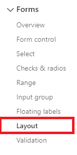
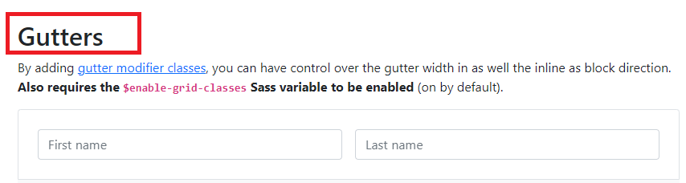
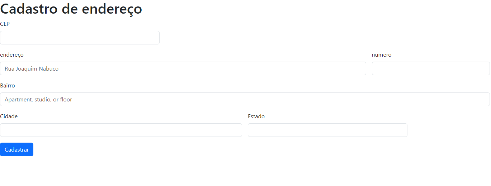

# form-CadEndereço

## 🚀 Descrição do projeto
* O projeto foi produzido através de um link do bootstrap 5 onde podemos acessar pelo seguinte menu:

* Viemos nos exemplos de formularios disponiveis no buutstrap e escolhemos o formulário forms e dentro de forms o layout

* Pegamos o código chamado Gutters 

* Editamos e removemos o e-mail, senha, Check me out e adicionamos o número, mechemos no elemento col para alterar a largura da coluna, colocamos o CEP antes de tudo para que quando for adicionado o CEP sejam preenchidas o restante das colunas.

  

* e foi assim que ficou a pagina!

* Adicionamos na linha 43 do html, o link de ligação no javascript para que seja ligado todas as funcionalidades do html no javascript.

[11:18] MARIA FERNANDA CASTILHO RIBEIRO

## ⚙️Funções

Iniciamos os códigos do JavaScript  
Função para limpar o formulário

    const limparFormulario = () => {
    document.getElementById('rua').value = '';
    document.getElementById('bairro').value = '';
    document.getElementById('cidade').value = '';
    document.getElementById('estado').value = '';
    }

Função para verificar se o CEP é valido:  

Na primeira função utilizamos Arrown Function, que testa número informado com expressão regular (espressão regular são padrões utilizados para selecionar combinações de caracteres em uma string.)  

    const eNumero = (numero) => /^[0-9]+$/.test(numero);

Na segunda função verifica tamnho do cep digitado e xeculta função de validação do cep eNumer

    const cepValido = (cep) => cep.length == 8 && eNumero(cep);

Tem a função de preencher formulário  

    const preencherFormulario = (endereco) => {
    document.getElementById('rua').value = endereco.logradouro;
    document.getElementById('bairro').value = endereco.bairro;
    document.getElementById('cidade').value = endereco.localidade;
    document.getElementById('estado').value = endereco.uf;
    }

Consumo da API da ViaCep  
abre uma porta para acessar a URL  

    const pesquisarCep = async () => {
    limparFormulario();
    const url = `http://viacep.com.br/ws/${cep.value}/json/`;
    if (cepValido(cep.value)) {
    const dados = await fetch(url);

JSON tipo de linguagem  

    const addres = await dados.json();
``hasOwnProperty`` retorna um booleano indicando se o objeto possui a propriedade especificada como uma propriedade definida no próprio objeto em questão  
    if (addres.hasOwnProperty('erro')) {
            alert('CEP não econtrado');
        } else {
            preencherFormulario(addres);
        }
    } else {
        alert('CEP Incorreto');
    }
    }
Adiciona efeito DOM ao input do CEP para executar função pesquisarCEP  
(o DOM é um tipo de caminho que irá te auxilar nos códigos.
Para mais informações acesse o link da [mozilla](https://developer.mozilla.org/pt-BR/docs/Web/API/Document_Object_Model/Introduction))
    document.getElementById('cep').addEventListener('focusout', pesquisarCep);    

## ⚙️Tecnologias utilizadas
As tecnologias utilizadas no desenvolvimento desse projeto foram:
* HTML5
* BOOTSTRAP 5

## ✒️Autor  
| [ Maria Fernanda 🤍](https://github.com/MaferCastilho) |  [ Janaina Paulino 🖤](https://github.com/janapaulinoo) |  [ Iris Carolina 💗](https://github.com/iriscarolina) |
| :---: | :---: | :---: |